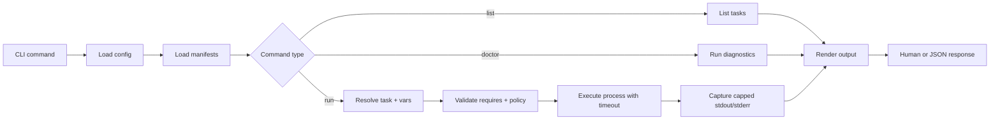

# TECHNICAL ARCHITECTURE

## System design

toolbox is a local-first orchestrator binary. It resolves config and manifests, validates dependencies, renders variable templates, executes the process with timeout/cancellation, and returns normalized output.

### Main subsystems

- `cmd/toolbox`: process entrypoint
- `internal/cli`: command/flag wiring and exit semantics
- `internal/config`: config loading and precedence merge
- `internal/manifest`: task parsing, validation, duplicate detection
- `internal/runner`: execution engine and output capture
- `internal/doctor`: diagnostics for config/manifests/runtimes
- `internal/output`: human + JSON presentation
- `pkg/contract`: stable output envelope types

## Data flow

## Execution contract

`toolbox run` returns a normalized envelope in JSON mode:

- `task`, `ok`, `exit_code`, `duration_ms`
- `stdout`, `stderr`, `artifacts`, `started_at`
- `stdout_truncated`, `stderr_truncated`, `stdout_bytes`, `stderr_bytes`

Dry-run outputs a separate envelope with resolved command/args/cwd/timeout/env (redacted).

## Dependencies and rationale

- `cobra`: mature command tree + flags
- `koanf/v2`: explicit, composable config merge behavior
- `yaml.v3`: strict manifest decode and validation support
- `slog`: standard structured logging in Go
- `testscript`: CLI behavior integration testing

## Scalability notes

- Internal packages isolate concerns, keeping future features (plugin delegation, schema validation, richer artifact handling) additive.
- Manifest/catalog model centralizes validation so new checks can be added in one path (`doctor` + runtime preflight).
- Output contract is in `pkg/contract` to prevent accidental breaking changes in machine clients.
